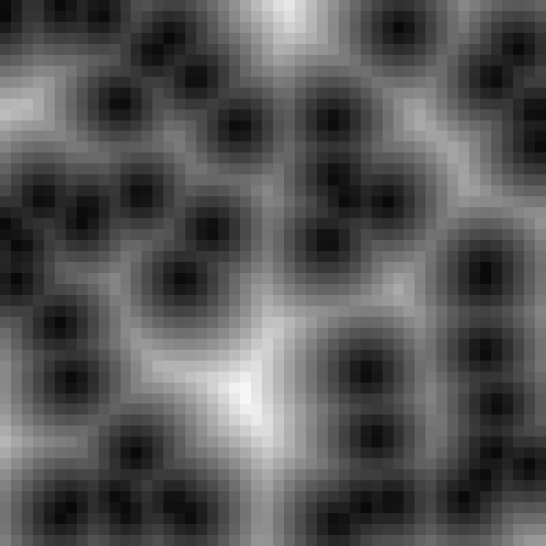

# Manim Surface From Array
This class creates a 3D surface from input list type variable e.g. ndarray.


### Installation
Copy this code and code and paste it into your project or download the file and import the function in your project.


### Dependencies
- Numpy (has been tested with 1.24)


### Usage
First of all prepare a 2D array containing a height map.
For example you can import an array from image, but then you have to reduced the number of channels to one and scaled it to smaller interval e.g. [0, 1]:

```python
import cv2 as cv

img = cv.imread('inputImg.png')
img = img[:, :, 0]
img /= 255
```

Input image as visualized as height map:
<p float="left">
  
</p>

The next step is generate a surface from earlier created image.
First - create an instance of `surfaceFromArray` class and next use `.generate()` method.

```python
class ExampleSurface(ThreeDScene):
    def construct(self):
        self.camera.background_color = '#1f1f1f'

        sfa = surfaceFromArray()
        surface = sfa.generate(img, fill_opacity=1, fill_color=[[17, 61, 0], [138, 255, 92]])

        self.add(surface)
        self.begin_ambient_camera_rotation(rate=0.43)
        self.wait(15)
```

Output animation with surface besed on input image:
<p float="left">
  
</p>


## Contact
email: maksymiliannorkiewicz@gmail.com
